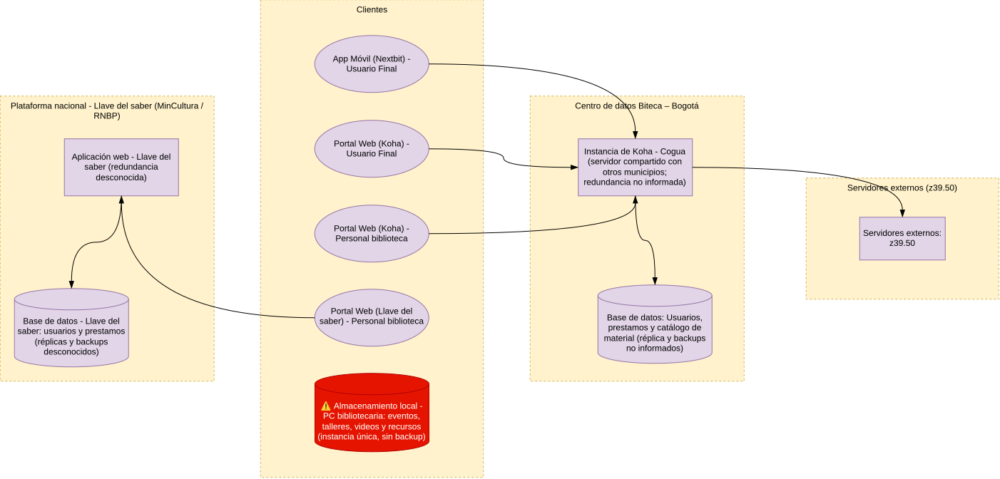

# 📄 Informe Técnico del Taller

## 🔖 Mapa de Infraestructura y Diagnóstico Técnico
_Taller 4 - Mapa de infraestructura y diagnóstico técnico_ 

## 👥 Integrantes del equipo
- Brayan Presiga (brayanprse@unisabana.edu.co)
- Julian Aguirre (julianagla@unisabana.edu.co)
- Jorge Alarcon (jorgealis@unisabana.edu.co)

## 🧠 Descripción general del trabajo
Con la realización de este taller se buscó conocer y aplicar un mapa de infraestructura para realizar un diagnóstico técnico y así detectar problemas o riesgos referentes a la disponibilidad, rendimiento o escalabilidad. El cliente sigue siendo la biblioteca pública municipal de Cogua - Rubiel Valencia Cossio, y el foco está en la infraestructura que soporta su operación diaria: el sistema de gestión bibliotecaria Koha, la plataforma nacional Llave del Saber y el equipo de trabajo de la bibliotecaria. Para realizar este proceso se siguió la guía de 5 pasos recomendada en el taller [1]: se identificaron los componentes utilizando la información recolectada previamente, fuentes públicas del proyecto y la documentación oficial de Koha, y consultando con un contacto que se tenía de Biteca, la empresa contratada por el IDECUT para la implementación de este sistema en las bibliotecas públicas de Cundinamarca [2]; se agruparon los componentes en 4 zonas o capas (clientes, centro de datos propio de Biteca en Bogotá, plataforma nacional de Llave del Saber y servidores externos Z39.50); se conectaron los componentes; se marcó la redundancia y capacidad; y se realizó el diagnóstico y priorización.

## 🔧 Proceso de desarrollo

#### Herramientas

- Draw.io: Realizar diagramas
- Editor markdown: Escribir documentación
- Git y github: Colaborar entre los miembros del equipo
- Claude: Preguntas puntuales y retroalimentación del desarrollo del taller [16].

#### Proceso

Se dividió el taller en dos partes: la creación del mapa de infraestructura y el análisis técnico.

El mapa de infraestructura se desarrolló en dos fases: una inicial, en donde exploramos la construcción del mapa intentando avanzar tanto como fuese posible con la información que teniamos a mano y construir una serie de preguntas que fueran necesarias realizarlas a la empresa (Biteca) encargada de implementar y mantener este sistema (Koha) por medio de la persona con la cual se había realizado una capacitación sobre el uso del sistema. En la segunda fase, se completó el mapa con las respuestas obtenidas de Biteca y con la información adicional del cliente. Biteca solo pudo responder una parte de las preguntas por restricciones contractuales, así que los aspectos que quedaron sin confirmar se marcaron explícitamente en el mapa como "no informado" o "desconocido".

1. **Revisión de la información pública**: Antes de contactar a Biteca revisamos el portal de la Red de Bibliotecas Públicas de Cundinamarca y la página de Biteca. Allí encontramos que cada municipio tiene su propio catálogo en un subdominio (el de Cogua incluido) [3], que existe una aplicación móvil llamada Nextbit para que los usuarios consulten el catálogo y gestionen reservas y renovaciones [4], y que los bibliotecarios importan registros desde servidores externos mediante el protocolo Z39.50 [5]. También revisamos la documentación oficial de Koha para entender qué piezas necesita una instalación de este sistema [7][8].
2. **Consulta a Biteca**: Diseñamos un cuestionario corto enfocado en lo que el paso 4 de la guía necesita confirmar (distribución de servidores, réplicas, backups, conectividad y acceso). Por WhatsApp nos confirmaron que los servidores están en un centro de datos propio en Bogotá, que las instancias de Koha de los municipios se manejan en varios servidores y que la app se conecta a Koha. Las demás preguntas no pudieron ser respondidas por contrato [13].
3. **Información del cliente**: Con lo que conocemos de la biblioteca identificamos que la bibliotecaria usa también la plataforma Llave del Saber para la inscripción de usuarios y los préstamos, que los usuarios se registran en los dos sistemas y que los archivos de trabajo diario (eventos, talleres, videos y recursos) están únicamente en su computador, sin nube ni copia de seguridad.
4. **Identificación de componentes**: Con la información anterior listamos los clientes (portales web y app), la instancia de Koha de Cogua y su base de datos, la aplicación web y la base de datos de Llave del Saber, los servidores externos Z39.50 y el almacenamiento local del PC de la bibliotecaria.
5. **Agrupación por zonas**: Separamos los componentes según dónde están y quién los administra: los clientes, el centro de datos de Biteca en Bogotá, la plataforma nacional de Llave del Saber y los servidores externos. Una decisión importante fue aclarar que en Cogua no hay ningún servidor: la "instancia de Koha de Cogua" es la copia de Koha con los datos de la biblioteca, pero físicamente se encuentra en Bogotá.
6. **Conexión de componentes**: Trazamos el tráfico desde cada cliente hacia el sistema que utiliza, y desde cada sistema hacia su base de datos. No se dibujó ninguna conexión entre Koha y Llave del Saber porque los dos sistemas no están conectados: pertenecen a iniciativas diferentes y su propósito también difiere. Koha es el sistema de gestión bibliotecaria implementado por Biteca para la red departamental del IDECUT [2], mientras que Llave del Saber es el sistema nacional del Ministerio de Cultura para identificar usuarios y reportar el uso de las bibliotecas públicas [10].
7. **Marcado de redundancia y capacidad**: Junto a cada componente crítico anotamos lo que sabemos de su redundancia. Como la mayoría de esta información no fue entregada, usamos las etiquetas "no informada" (Biteca no la reveló) y "desconocida" (no tuvimos fuente para consultarla), y "instancia única" para el único caso confirmado.
8. **Diagnóstico y priorización**: Con las marcas del paso anterior clasificamos cada riesgo en una categoría (disponibilidad, rendimiento o escalabilidad) y lo priorizamos según su impacto, como se muestra en la sección de análisis.

## 🧩 Análisis del modelo propuesto

### Estructura del modelo
El mapa se organiza en cuatro zonas, cada una dibujada como un contenedor con borde punteado según la notación de la guía [1]:

- **Clientes**: agrupa los puntos de entrada al sistema, representados como óvalos: la app móvil Nextbit y el portal web de Koha que usa el usuario final, y los portales web de Koha y de Llave del Saber que usa el personal de la biblioteca. En esta zona también se ubica el almacenamiento local del PC de la bibliotecaria, representado como base de datos (cilindro).
- **Centro de datos Biteca – Bogotá**: contiene la instancia de Koha de Cogua, que corre en un servidor compartido con otros municipios, y su base de datos con usuarios, préstamos y catálogo de material.
- **Plataforma nacional - Llave del Saber (MinCultura / RNBP)**: contiene la aplicación web de Llave del Saber y su base de datos de usuarios y préstamos. Es un sistema distinto, administrado a nivel nacional por el Ministerio de Cultura y la Red Nacional de Bibliotecas Públicas [10].
- **Servidores externos (Z39.50)**: representa los catálogos de terceros que Koha consulta para importar registros bibliográficos al momento de catalogar [5].

Las conexiones muestran la dirección del tráfico: los tres clientes de Koha (app, portal del usuario final y portal del personal) llegan a la instancia de Koha de Cogua, que a su vez escribe en su base de datos y consulta los servidores Z39.50. Por separado, el portal de Llave del Saber del personal llega a la aplicación web de Llave del Saber, que escribe en su propia base de datos.

### Diagnóstico técnico
Los componentes de esta tabla son los que se resaltan en el mapa como componentes en riesgo. Además de las columnas que propone la guía, agregamos una columna de **evidencia** para distinguir los riesgos confirmados de los que se derivan de información no entregada por el proveedor.

| Componente | Riesgo diagnosticado | Categoría | Impacto si ocurre | Prioridad | Evidencia |
|---|---|---|---|---|---|
| Almacenamiento local - PC bibliotecaria (instancia única, sin backup) | Punto único de falla | Disponibilidad | Pérdida permanente de los archivos de eventos, talleres, videos y recursos de la biblioteca ante daño, robo o falla del disco | Alta | Confirmado por el cliente |
| Base de datos de Koha (réplica y backups no informados) | Punto único de falla potencial | Disponibilidad | Posible pérdida del catálogo de Cogua y del trabajo de catalogación acumulado | Alta | No informado por Biteca [13] |
| Base de datos de Llave del Saber (réplicas y backups desconocidos) | Punto único de falla potencial | Disponibilidad | Posible pérdida del registro de usuarios y del historial de préstamos | Alta | Desconocido |
| Aplicación web de Llave del Saber (redundancia desconocida) | Punto único de falla potencial | Disponibilidad | Mientras esté caída, la biblioteca no puede inscribir usuarios ni registrar préstamos | Media | Desconocido |
| Instancia de Koha - Cogua (servidor compartido con otros municipios) | Punto único de falla compartido | Disponibilidad | El catálogo público, la app Nextbit y la catalogación quedan inaccesibles para Cogua y para los municipios alojados en el mismo servidor | Media | Inferido [6][9][13] |

El criterio de priorización fue el impacto, como pide la guía [1]: los riesgos que implican **pérdida permanente de información** quedaron en prioridad alta, y los que implican una **interrupción temporal del servicio** quedaron en prioridad media. La instancia de Koha quedó en media porque, si falla, la biblioteca puede seguir prestando libros e inscribiendo usuarios a través de Llave del Saber. Todos los riesgos encontrados son de disponibilidad; no identificamos riesgos de rendimiento o escalabilidad porque el proveedor no entregó información de capacidad ni de carga.

### Observaciones adicionales
Hay dos hallazgos que no encajan en las categorías de la tabla de diagnóstico, pero que vale la pena dejar documentados:

- **Doble registro de usuarios**: los usuarios de la biblioteca se registran tanto en Koha como en Llave del Saber, y en el mapa no existe ninguna conexión entre ambos sistemas. Esto implica que el mismo dato se ingresa dos veces de forma manual, lo que puede generar doble trabajo para la bibliotecaria y diferencias entre la información de ambos sistemas.
- **Dependencia de la conexión a internet de la biblioteca**: en Cogua no hay servidores, por lo que todas las operaciones (catalogación, préstamos e inscripción) dependen de la conexión a internet de la biblioteca. No se pudo confirmar si existe un procedimiento para seguir prestando material cuando no hay conexión.

### Cómo representa las necesidades del cliente
El mapa refleja la situación **AS-IS** de la biblioteca: muestra que toda la infraestructura que soporta sus servicios (catálogo, préstamos e inscripción de usuarios) está fuera del municipio y en manos de terceros, y que lo único que la biblioteca administra directamente es el computador de la bibliotecaria. Esto le permite al cliente ver con claridad dónde puede actuar por su cuenta (por ejemplo, implementar copias de seguridad de sus archivos locales) y dónde depende de Biteca o del Ministerio de Cultura. Además, al mostrar las dos plataformas sin conexión entre ellas, el mapa explica visualmente el doble registro que la bibliotecaria hace a diario.

### Supuestos tomados
- La instancia de Koha de Cogua comparte servidor con instancias de otros municipios. Biteca confirmó que las instancias están en varios servidores [13], pero el proyecto tiene más de 150 sistemas Koha [6] y el paquete oficial de Koha está diseñado para alojar varias instancias en un mismo servidor [9], por lo que asumimos que cada servidor aloja más de una instancia.
- Cada instancia de Koha tiene su propia base de datos, de acuerdo con el funcionamiento estándar del paquete oficial [9].
- Llave del Saber tiene su propia base de datos, ya que almacena el registro de usuarios con sus datos personales [12]. Su infraestructura interna no es pública y se representó como caja negra.
- Koha incluye un módulo de préstamos y por eso aparece en su base de datos; sin embargo, en Cogua la operación diaria de préstamos se hace en Llave del Saber. No se confirmó si los préstamos también quedan registrados en Koha.
- Los componentes internos de Koha (motor de búsqueda, caché, servidor web, etc.) existen en cualquier instalación [7][8], pero no se dibujaron porque Biteca no los confirmó y el nivel de detalle de la guía es de servidor o módulo [1].
- No se dibujó balanceador de carga, firewall ni proxy porque no hay información que confirme su existencia.

### Limitaciones
Por restricciones contractuales, Biteca no pudo entregar información sobre réplicas de la base de datos, copias de seguridad, redundancia eléctrica o de conectividad del centro de datos, ni sobre la forma de acceso del personal. Por esta razón, varios de los riesgos de la tabla se presentan como potenciales: el mapa no confirma que exista la falta de redundancia, sino que no hay evidencia de que la redundancia exista. Esta distinción se mantiene en la columna de evidencia del diagnóstico.

## 📈 Diagrama final entregado

## 📋 Tabla de actores, entidades o componentes (si aplica)

| Nombre del elemento | Tipo | Descripción | Responsable |
|---------------------|------|-------------|-------------|
| App Móvil (Nextbit) - Usuario Final | Cliente (óvalo) | Aplicación para Android e iOS con la que los usuarios consultan el catálogo, hacen reservas y renovaciones y reciben recordatorios [4]. Se conecta a la instancia de Koha [13]. | Biteca |
| Portal Web (Koha) - Usuario Final | Cliente (óvalo) | Catálogo público en línea (OPAC) de la biblioteca de Cogua, en su propio subdominio [3]. | Biteca |
| Portal Web (Koha) - Personal biblioteca | Cliente (óvalo) | Interfaz del personal para catalogar material, incluida la importación de registros por Z39.50 [2][5]. | Biblioteca pública municipal de Cogua (uso) |
| Portal Web (Llave del Saber) - Personal biblioteca | Cliente (óvalo) | Acceso de la bibliotecaria a Llave del Saber para la inscripción de usuarios [11] y el registro de préstamos. | Biblioteca pública municipal de Cogua (uso) |
| Almacenamiento local - PC bibliotecaria | Base de datos (cilindro) | Única copia de los archivos de eventos, talleres, videos y recursos de la biblioteca, sin nube ni copia de seguridad. | Biblioteca pública municipal de Cogua |
| Instancia de Koha - Cogua | Servidor / servicio (rectángulo) | Instalación de Koha con la configuración y los datos de Cogua, alojada en un servidor compartido del centro de datos de Biteca en Bogotá [9][13]. | Biteca |
| Base de datos de Koha | Base de datos (cilindro) | Almacena usuarios, préstamos y catálogo de material de la instancia de Cogua. | Biteca |
| Aplicación web - Llave del Saber | Servidor / servicio (rectángulo) | Sistema Nacional de Información para identificar usuarios, organizar servicios y reportar el uso de las bibliotecas públicas [10]. | Ministerio de Cultura / Red Nacional de Bibliotecas Públicas |
| Base de datos - Llave del Saber | Base de datos (cilindro) | Almacena el registro de usuarios (con sus datos personales) y los préstamos [12]. | Ministerio de Cultura / Red Nacional de Bibliotecas Públicas |
| Servidores externos Z39.50 | Servidor / servicio (rectángulo) | Catálogos de otras instituciones que Koha consulta para importar registros bibliográficos [5][8]. | Instituciones externas |

## 🔍 Investigación complementaria

### Tema 1: La regla 3-2-1 de copias de seguridad

El hallazgo con mayor certeza de nuestro diagnóstico fue que los archivos de trabajo de la biblioteca existen en una sola copia, en el computador de la bibliotecaria. Quisimos investigar qué se considera una buena práctica para resolver este tipo de situación y encontramos que la recomendación más extendida es la regla 3-2-1, promovida por la agencia de ciberseguridad de Estados Unidos (CISA) [14]. La regla consiste en mantener tres copias de cada archivo importante (la original y dos respaldos), guardarlas en dos tipos de medio diferentes para protegerse de distintos tipos de daño, y conservar una de ellas fuera del lugar de trabajo [14][15].

Lo interesante de esta regla para nuestro taller es que cada uno de sus números ataca un punto único de falla distinto: tener tres copias evita depender de un solo archivo, usar dos medios evita que una sola falla de hardware afecte todas las copias, y tener una copia fuera del sitio protege contra eventos que afectan el lugar completo, como un robo, una inundación o un incendio en la biblioteca. CISA también recomienda que los respaldos se hagan de forma automática y regular, combinando copias locales y remotas [15], lo que en el caso de la biblioteca evitaría que la protección de los archivos dependa de que la bibliotecaria se acuerde de hacerla.

Aplicado a nuestro mapa, hoy la biblioteca está en un "1-1-0": una copia, un medio y ninguna copia fuera del sitio. Una solución sencilla y de bajo costo sería sumar un disco externo y un servicio de almacenamiento en la nube, lo que en el mapa se traduciría en un nuevo componente de almacenamiento conectado al PC de la bibliotecaria y en la eliminación de la marca de instancia única. Esto la convierte en la recomendación más fácil de implementar de todo el diagnóstico, ya que es el único riesgo que la biblioteca puede resolver por su cuenta, sin depender de Biteca ni del Ministerio de Cultura.

### Tema 2: El modelo multi-instancia de Koha

Al construir el mapa nos surgió la duda de cómo era posible que más de 150 bibliotecas tuvieran cada una su propio Koha [6] con un solo proveedor, así que investigamos cómo se instala este sistema. Encontramos que el paquete oficial de Koha para Debian incluye herramientas para crear y administrar varias instancias en un mismo servidor, y que está pensado precisamente para organizaciones que prestan servicio de hosting de Koha [9]. Cada instancia tiene su propio nombre, su propio dominio y su propia base de datos, y además ejecuta sus propios servicios de apoyo, como el motor de búsqueda y el servidor de Z39.50 [8][9].

Esto explica lo que vimos en el portal de la red, donde cada municipio tiene su propio subdominio [3], y le da sentido a la respuesta de Biteca de que las instancias "se manejan en varios servidores" [13]: lo más probable es que cada servidor aloje un grupo de municipios. Esta forma de organización tiene una ventaja clara frente a tener un solo servidor para todos, ya que una falla no deja sin servicio a toda la red de bibliotecas. Sin embargo, también significa que la disponibilidad del Koha de Cogua no depende solo de su propia instancia, sino del servidor que comparte con otros municipios.

Por eso decidimos marcar la instancia de Koha de Cogua como "servidor compartido" y no como un servidor propio de la biblioteca. Este punto nos sirvió además para reforzar una decisión de modelado: representar a Koha como una caja negra a nivel de instancia, sin dibujar sus componentes internos, porque aunque la documentación oficial nos dice qué piezas existen en cualquier instalación [7], no tenemos confirmación de cómo están distribuidas en el caso específico de Biteca.

## 📚 Referencias

**Guía del curso:**

- [1] Universidad de La Sabana, curso AREM. *Guía Paso a Paso: Mapa de Infraestructura y Diagnóstico Técnico* (Taller 4). Material de clase.

**Proyecto Koha de la Red de Bibliotecas Públicas de Cundinamarca:**

- [2] Biteca S.A.S. *Koha como herramienta de acceso al conocimiento*. 2025. https://www.biteca.com/koha_acceso_conocimiento/
- [3] Red de Bibliotecas Públicas de Cundinamarca. *Catálogos Bibliográficos*. 2026. https://www.bibliotecasidecut.com/catalogos/
- [4] Red de Bibliotecas Públicas de Cundinamarca. *Aplicación*. 2025. https://www.bibliotecasidecut.com/aplicacion/
- [5] Red de Bibliotecas Públicas de Cundinamarca. *Formación para Bibliotecarios*. 2025. https://www.bibliotecasidecut.com/formacion/
- [6] Biteca S.A.S. *Clientes Koha*. https://www.biteca.com/clientes/clientes-koha/

**Arquitectura de Koha:**

- [7] Koha Community. *Installing Koha*. Koha Manual. https://koha-community.org/manual/latest/en/html/installation.html
- [8] Koha Community. *Koha on Debian*. Koha Wiki. https://wiki.koha-community.org/wiki/Koha_on_Debian
- [9] *koha-common man pages* (espejo de las páginas de manual del paquete). http://div.libriotech.no/kohamisc/man/koha-common.html

**Llave del Saber:**

- [10] Biblioteca Nacional de Colombia. *La Llave del Saber se actualiza y se renueva*. 2021. https://www.bibliotecanacional.gov.co/es-co/actividades/noticias/en-la-rnbp/llave-del-saber-se-actualiza
- [11] Biblioteca Nacional de Colombia. *Instructivo Llave del Saber*. 2016. https://www.bibliotecanacional.gov.co/es-co/Footer/Documents/servicios%20bibliotecarios%20innovadores/20160314_llave_del_saber.pdf
- [12] Red Nacional de Bibliotecas Públicas. *Llave del Saber - Registro de usuarios*. https://llavedelsaberrnbp.gov.co/manual_usuario/reg_usu/registro_usuarios.php

**Comunicación personal:**

- [13] Contratista de Biteca S.A.S. Comunicación personal por WhatsApp sobre la infraestructura de Koha. Octubre de 2026.

**Sobre copias de seguridad:**

- [14] US-CERT / CISA. *Data Backup Options*. https://www.cisa.gov/sites/default/files/publications/data_backup_options.pdf
- [15] CISA. *Back Up Business Data*. https://www.cisa.gov/audiences/small-and-medium-businesses/secure-your-business/back-up-business-data

**Uso de inteligencia artificial:**

- [16] Fuente asistida por IA: Claude (Anthropic), octubre 2026.

---

_Este documento hace parte de la entrega del taller 4 del curso AREM (Arquitectura Empresarial) - Universidad de La Sabana._
